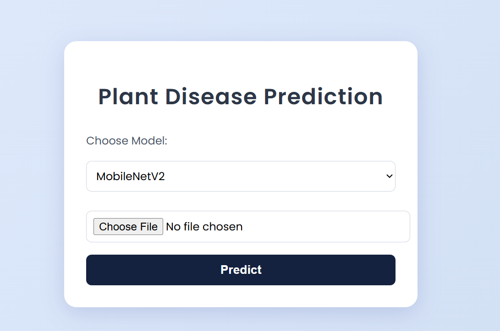
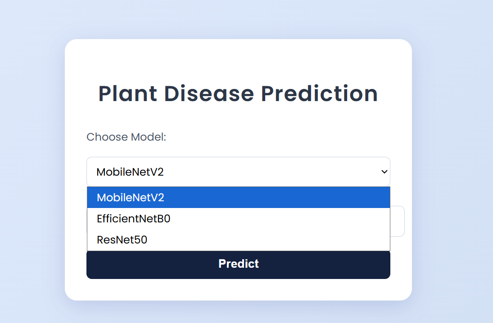
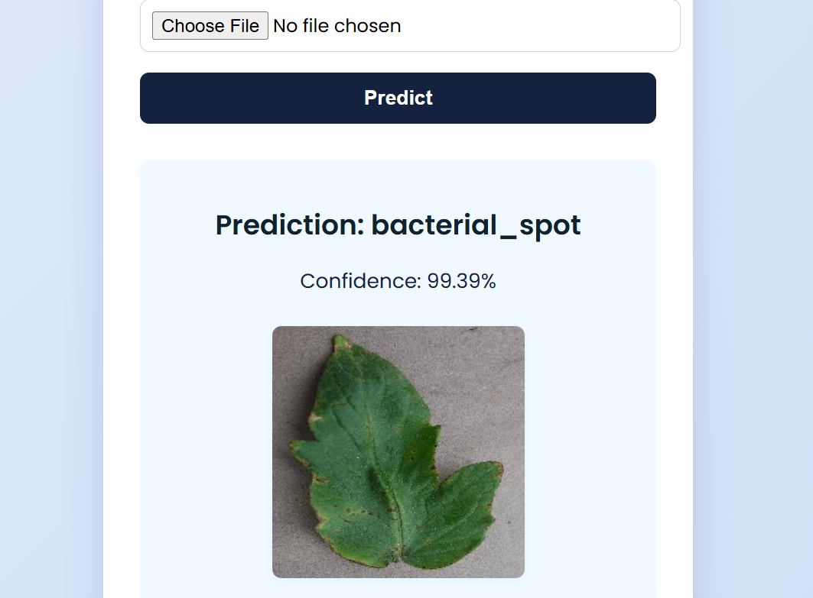
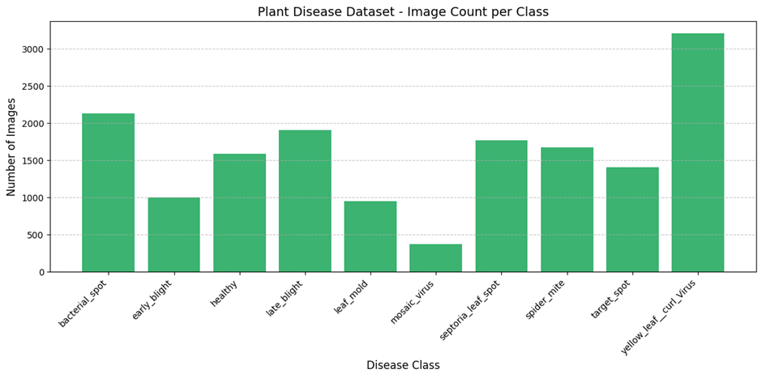
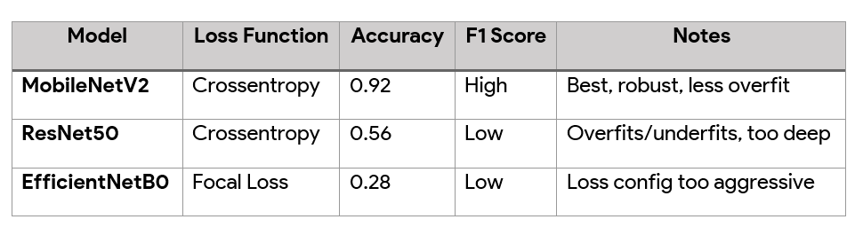

# Plant Disease Detection Using Transfer Learning

A deep learning project that classifies plant diseases using transfer learning with three CNN architectures: MobileNetV2, ResNet50, and EfficientNetB0, featuring a Flask web application for real-time disease classification.

## Overview

This project implements plant disease detection using state-of-the-art deep learning models. By leveraging transfer learning, the system achieves high accuracy in identifying various plant diseases from leaf images, providing a practical tool for agricultural applications.

## Features

- Multiple model implementations (MobileNetV2, ResNet50, EfficientNetB0)
- Transfer learning with pre-trained ImageNet weights
- Data augmentation techniques for improved generalization
- Flask-based web interface for image classification
- Comprehensive model evaluation with multiple metrics
- Two-stage training approach: feature extraction and fine-tuning


## Screenshots





## Model Architecture

### Implemented Models
1. **MobileNetV2** - Lightweight architecture optimized for efficiency
2. **ResNet50** - Deep residual network for complex feature extraction
3. **EfficientNetB0** - Compound scaling methodology for balanced performance

### Training Strategy
- **Stage 1**: Feature extraction with frozen base model layers
- **Stage 2**: Fine-tuning with trainable top layers
- **Data Augmentation**: Rotation, zoom, horizontal flip, brightness adjustment
- **Loss Functions**: Categorical crossentropy and focal loss evaluation


## Analysis



### Setup
1. Clone the repository:
```bash
git clone https://github.com/mayuriphad/Plant-Disease-Detection-Transfer-learning.git
cd Plant-Disease-Detection-Transfer-learning
```

2. Install dependencies:
```bash
pip install -r requirements.txt
```

## Usage

### Model Training
```bash
# Train individual models
python train_mobilenetv2.py
python train_resnet50.py
python train_efficientnetb0.py
```

### Web Application
```bash
python app.py
```
Access the application at `http://localhost:5000`

## Web Application Structure

The Flask application provides three routes for model selection and prediction:
- Root route for model selection interface
- Individual routes for each model (MobileNetV2, ResNet50, EfficientNetB0)
- Image upload and real-time prediction capabilities

## Model Performance

| Model | Performance | Characteristics |
|-------|------------|----------------|
| MobileNetV2 | Best Overall | Superior generalization, lightweight |
| ResNet50 | Good | Complex feature learning capability |
| EfficientNetB0 | Good | Balanced performance and efficiency |

**Result**: MobileNetV2 demonstrated the best performance, attributed to its efficient architecture and superior generalization capabilities for the given dataset size.

## Project Structure

```
├── models/
│   ├── mobilenetv2_model.h5
│   ├── resnet50_model.h5
│   └── efficientnetb0_model.h5
├── templates/
├── static/
├── app.py
└── requirements.txt
```

## Methodology

### Data Processing
- Image preprocessing and normalization
- Dataset splitting (train/validation/test)
- Data augmentation implementation

### Transfer Learning Implementation
1. Load pre-trained models with ImageNet weights
2. Feature extraction phase with frozen base layers
3. Fine-tuning phase with trainable classifier layers
4. Model evaluation using accuracy, F1-score, and confusion matrices

### Evaluation Metrics
- Classification accuracy
- F1-score for balanced performance assessment
- Confusion matrix analysis
- Comparative analysis across all three models



## Author

**Mayuri Phad**  
GitHub: [@mayuriphad](https://github.com/mayuriphad)